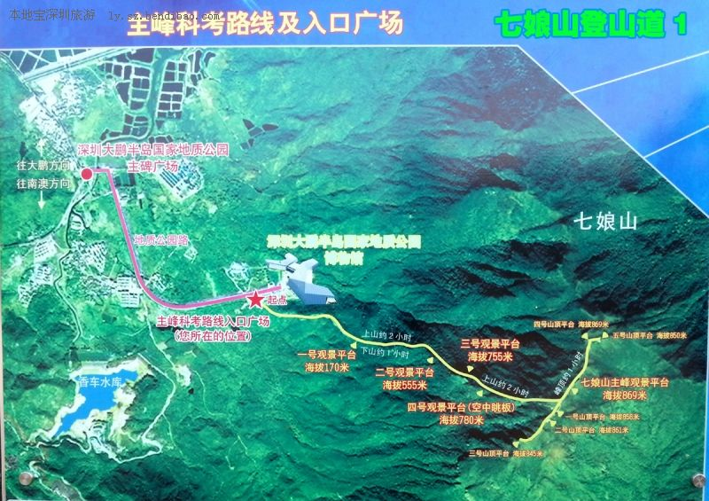

# 七娘山

## 介绍

- 名称：七娘山
- 海拔：869m
- 开放时间：全年 9:00-18:00(夜间及阴雨天气封山，下午4点之后禁止上山！！！)
- 门票价格：免费

## 交通

- 地质公园登山口:
    - 地铁： \
    - 公交： \
    - 建议自驾或者跟团

## 登山路线

- 路线1：
    - 主峰科考线（https://earth.google.com/earth/d/1gA-nipONZfZq_xwXliBvYTWL8REHDptQ?usp=sharing）
      

